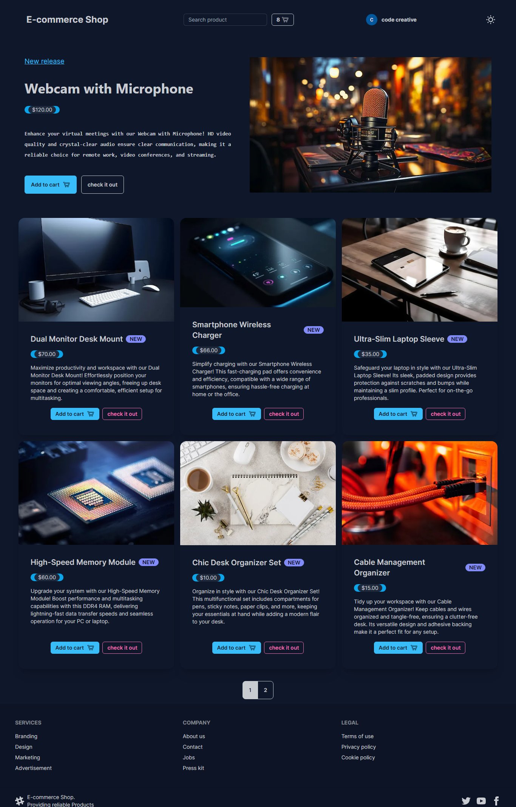

## Enhance Your Shopping Experience with E-Commerce-Shop's Intuitive Features

### Tech Stack: Next.js, TypeScript, Tailwind CSS, Prisma, MongoDB

E-Commerce-Shop revolutionizes online shopping with its user-centric approach and intuitive functionalities, powered by a sophisticated tech stack. With a focus on convenience and exploration, E-Commerce-Shop offers an "Anonymous Cart" feature, enabling users to browse and add items without signing in. Seamlessly merge your selections upon sign-in, ensuring a hassle-free shopping journey.

## Key Features

- **Anonymous Cart & Merging Capability:** Explore products without commitment.
- **Quantity Adjustment:** Easily manage product quantities in your cart.
- **Google Sign-In:** Access additional features while signed in with Google.
- **Efficient Pagination:** Navigate through products with a sleek pagination bar.
- **Robust Search Functionality:** Find items effortlessly with a powerful search bar.
- **Aesthetic UI Design:** Enjoy a visually appealing interface for a delightful shopping experience.
- **Dark/Light Theme Modes:** Customize your browsing with preferred themes.
- **Detailed Product Pages:** Dive into comprehensive product views for informed decisions.
- **SSR Rendering:** Experience enhanced speed and performance with server-side rendering.

## Showcase

E-Commerce-Shop leverages a robust tech stack including TypeScript, Tailwind CSS, Prisma, and MongoDB, ensuring a seamless, responsive, and feature-rich shopping platform.

E-Commerce-Shop empowers users with personalized options and a smooth browsing experience, making it the go-to destination for online shopping.
